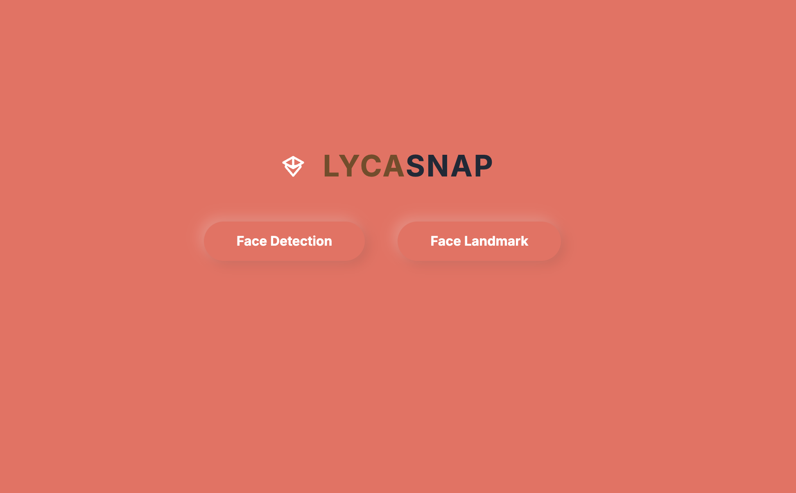

# LYCASNAP - Face Detection and Landmark Detection with MediaPipe and Next.js



This project demonstrates real-time face detection and face landmark detection using MediaPipe's FaceDetector and FaceLandmarker within a Next.js application. The application captures video from the user's webcam, detects faces or facial landmarks, and displays them on a canvas overlay. It also allows the user to take snapshots of the detected faces or landmarks.

## Features

- **Real-time Face Detection**: Detects faces in the video stream from the webcam.
- **Real-time Face Landmark Detection**: Detects facial landmarks on the detected faces.
- **Snapshot Functionality**: Captures and downloads a snapshot of the current video frame with detected faces or landmarks.
- **Responsive Design**: Optimized for various screen sizes with dynamic particle background animation.

## Getting Started

### Prerequisites

To set up and run the project, ensure you have the following installed:

- Node.js (v14.x or later)
- npm (v6.x or later) or yarn (v1.x or later)
- Git (for cloning the repository)

### Installation

1. **Clone the repository**:

   ```bash
   git clone https://github.com/your-username/your-repository-name.git
   cd your-repository-name
   ```

2. **Install dependencies**:

   Using npm:
   ```bash
   npm install
   ```

   Or using yarn:
   ```bash
   yarn install
   ```

3. **Run the development server**:

   Using npm:
   ```bash
   npm run dev
   ```

   Or using yarn:
   ```bash
   yarn dev
   ```

4. **Access the application**:

   Open your web browser and navigate to `http://localhost:3000` to see the application in action.

## Project Structure

The project consists of two main pages:

- **Face Detection**: Located in `pages/face-detection.js`
- **Face Landmark Detection**: Located in `pages/face-landmark.js`

### Key Components and Logic

#### Face Detection

1. **Initialization**:
   - The `FaceDetector` from MediaPipe is initialized using the `FilesetResolver` to load necessary WASM files.
   - The face detector is configured to use the GPU for faster processing and is set to `VIDEO` mode for continuous detection.

2. **Webcam Setup**:
   - The user's webcam stream is captured using the `getUserMedia` API and is displayed in a `<video>` element.
   - Once the video data is loaded, face detection begins on each frame of the video.

3. **Face Detection Logic**:
   - The `detectForVideo` method runs continuously to detect faces in the video stream.
   - If a face is detected, a bounding box is drawn around the face on the canvas.
   - The confidence score of the detection is also displayed on the canvas.

4. **Snapshot Functionality**:
   - The user can take a snapshot of the current video frame with the detected face(s), which is then downloaded as a PNG image.

#### Face Landmark Detection

1. **Initialization**:
   - Similar to face detection, the `FaceLandmarker` is initialized with the necessary WASM files and set to use the GPU for performance.
   - The face landmarker is configured to detect facial landmarks for one face at a time and is set to `VIDEO` mode.

2. **Webcam and Landmark Detection**:
   - The webcam is activated, and the video stream is displayed in a `<video>` element.
   - The `detectForVideo` method is used to detect facial landmarks in each frame of the video stream.
   - Detected landmarks are drawn on the canvas, overlaying the video feed.

3. **Snapshot Functionality**:
   - Similar to face detection, a snapshot of the current frame with the detected landmarks can be taken and downloaded as a PNG image.

### Chapter: Implementing and Solving Face Detection and Face Landmark Detection in a Web Application

#### Introduction

Face detection and face landmark detection are crucial technologies in various applications ranging from security systems to augmented reality. In this chapter, we explore how these technologies were implemented in a web application using MediaPipe and Next.js, including the logic behind the detection process and the challenges encountered and resolved during development.

#### 1. Understanding Face Detection and Face Landmark Detection

**Face Detection** refers to the process of identifying and locating human faces in digital images or video streams. It serves as the first step in many facial recognition systems, as it isolates the facial region from the rest of the image.

**Face Landmark Detection** goes a step further by identifying specific facial features, such as the eyes, nose, and mouth. These landmarks are essential for applications like facial expression recognition, face alignment, and 3D face modeling.

#### 2. Tools and Technologies Used

- **MediaPipe**: An open-source framework developed by Google that provides ready-to-use models and solutions for real-time perception in web and mobile applications.
- **Next.js**: A popular React framework that enables server-side rendering and static site generation, making it ideal for building web applications.
- **HTML5 Canvas**: Used to draw the detected faces and landmarks on a visual layer over the video stream.
- **Tailwind CSS**: A utility-first CSS framework used for styling the application.

#### 3. Setting Up the Environment

Before diving into the logic, it was necessary to set up the development environment. This involved installing Node.js, npm, and setting up a Next.js project. The MediaPipe models were integrated into the project using the `@mediapipe/tasks-vision` library, which provides a simplified interface for deploying face detection and landmark detection models.

#### 4. Face Detection Logic

**4.1 Initialization**

The first step was to initialize the `FaceDetector` from the MediaPipe library. This was done by loading the necessary WebAssembly (WASM) files using the `FilesetResolver` and configuring the `FaceDetector` with specific options:

- **Model Path**: The path to the pre-trained face detection model.
- **Delegate**: Configured to use the GPU for processing, which significantly speeds up the detection process.
- **Running Mode**: Set to `VIDEO` to enable real-time face detection from the webcam feed.

```javascript
const detector = await FaceDetector.createFromOptions(vision, {
  baseOptions: {
    modelAssetPath: `/models/blaze_face_short_range.tflite`,
    delegate: 'GPU',
  },
  runningMode: 'VIDEO',
});
```

**4.2 Webcam Setup**

To feed real-time video data into the face detector, the application needed access to the user's webcam. This was achieved using the `navigator.mediaDevices.getUserMedia()` API, which requests the webcam stream and displays it in a `<video>` element.

```javascript
const stream = await navigator.mediaDevices.getUserMedia({ video: true });
videoRef.current.srcObject = stream;
videoRef.current.style.display = 'block';
```

**4.3 Continuous Face Detection**

Once the video stream was live, the `detectForVideo` method was invoked in a loop to continuously process each frame and detect faces. The bounding box around the detected faces was then drawn on the canvas overlay.

```javascript
const results = await faceDetector.detectForVideo(videoRef.current, performance.now());

if (results.detections.length > 0) {
  const detection = results.detections[0];
  // Calculate bounding box and draw it on the canvas
}
```

**4.4 Handling Edge Cases**

Several edge cases were handled during development:

- **No Faces Detected**: When no faces were detected in a frame, the canvas was cleared to remove any previously drawn bounding boxes.
- **Webcam Access Issues**: Proper error handling was implemented to notify the user if the webcam was not accessible.

#### 5. Face Landmark Detection Logic

**5.1 Initialization**

Similar to face detection, the face landmark detection required initializing the `FaceLandmarker` with the appropriate model and configuration options. The key difference was enabling the `outputFaceBlendshapes` option to retrieve detailed facial feature points.

```javascript
const faceLandmarkerInstance = await FaceLandmarker.createFromOptions(filesetResolver, {
  baseOptions: {
    modelAssetPath: "/models/face_landmarker.task",
    delegate: "GPU",
  },
  outputFaceBlendshapes: true,
  runningMode: "VIDEO",
  numFaces: 1,
});
```

**5.2 Landmark Detection Process**

The core logic of landmark detection involved continuously processing each frame of the video to detect specific facial features. If detected, these landmarks were drawn on the canvas using simple geometric shapes like circles.

```javascript
const results = faceLandmarker.detectForVideo(videoRef.current, performance.now());

if (results.faceLandmarks && results.faceLandmarks.length > 0) {
  results.faceLandmarks.forEach((landmarks) => {
    drawLandmarks(landmarks, ctx, "#ffffff");
  });
}
```

**5.3 Redrawing for Snapshot**

To allow users to capture snapshots with the detected landmarks, a function was created to redraw the landmarks on the canvas before taking the snapshot. The canvas content was then converted to a PNG image that the user could download.

```javascript
const dataUrl = canvasRef.current.toDataURL("image/png");
const link = document.createElement("a");
link.href = dataUrl;
link.download = "snapshot.png";
link.click();
```

#### 6. Challenges and Solutions

**6.1 Performance Optimization**

Real-time face detection and landmark detection can be computationally intensive, especially on lower-end devices. By leveraging the GPU through MediaPipe's `delegate` option, the detection process was significantly sped up. Additionally, careful management of the detection loop ensured that unnecessary computations were avoided, particularly when no video data was available.

**6.2 Handling Video and Canvas Resizing**

Another challenge was ensuring that the video and canvas elements maintained the correct aspect ratio, especially when the browser window was resized. This was solved by dynamically adjusting the canvas dimensions to match the video feed and recalculating the scaling factors for the detected landmarks.

**6.3 User Experience Enhancements**

To improve user experience, several enhancements were made:

- **Visual Feedback**: Clear visual feedback was provided through the bounding boxes and landmark points.
- **Error Handling**: Comprehensive error messages were displayed for issues like denied webcam access or unsupported browsers.
- **Responsive Design**: The application was styled using Tailwind CSS to ensure it was fully responsive and visually appealing on various devices.
